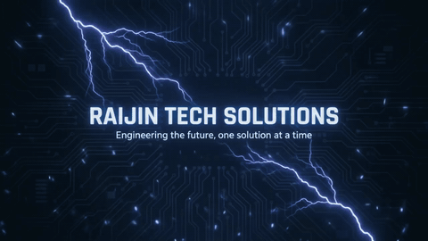

### Hi, I'm Harley Busa, Engineering the Future at Raijin Tech Solutions

---

### About Me

I'm a Full-Stack Developer based in the Philippines. I specialize in building responsive web applications, mobile apps, and AI-driven automation. As a BSIT graduate (Cum Laude) from Liceo de Cagayan University, I combine solid engineering principles with modern developer workflows through my company, Raijin Tech Solutions.

- **Education:** Bachelor of Science in Information Technology (Cum Laude, multiple Dean's Lister honors) at Liceo de Cagayan University.
- **Founder & Lead Developer:** Building web, mobile, and enterprise software for clients under Raijin Tech Solutions — 120+ projects delivered, 100+ satisfied clients.
- **Industries Served:** Healthcare, education, business operations, finance & retail, and field/industrial systems — from clinic management to multi-branch POS platforms.
- **Certifications:** HackForGov 3 CTF Competition (DICT Region 10), DevFest Cagayan de Oro 2024 (GDG), TopCIT Level 3.
- **AI & Automation:** Experienced integrating OpenAI API, on-device OCR, and automated workflows to streamline operations for clients.

### Project Portfolio

> **Selected projects from academic, client, and product work. Some client systems are protected by NDA and are not shown publicly.**

#### Liceo / LDCU Systems

| Project | Value & scope |
|---|---|
| [LDCU Clinic](https://github.com/OsirisXx/LDCU_Clinic) | **Medical & dental appointment platform for Liceo de Cagayan University** — multi-campus scheduling, seven-role access control, nurse assignment, audit logs, notifications, rescheduling, rate-limited sign-in, and Supabase RLS. [Live demo](https://ldcu-clinic.vercel.app) |
| [LDCU IoT Capstone](https://github.com/OsirisXx/LDCUIOTCapstone) | **IoT classroom attendance and access-control system** — RFID instructor access, student fingerprint attendance, course/schedule management, device and room controls, analytics, and audit records. Built with React, Node/Express, MySQL, and JWT. |
| [LabTrack — Clinical Health Sciences](https://github.com/OsirisXx/lab-release) | **Client project: laboratory inventory and lending system** — consumables/equipment tracking, reservations, borrow/return workflows, role-based access, attendance, reports, RLE guides, and audits. |
| [Liceo 8888](https://github.com/OsirisXx/Liceo8888) | **University concern-management platform** — anonymous reports, reference tracking, department and VP workflows, file attachments, and an auditable resolution trail. [Live demo](https://liceo8888.vercel.app) |
| [Liceo Event Attendance](https://github.com/OsirisXx/attendanceapp) | **Event and attendance platform** — student registration rules, semester event management, SuperAdmin dashboard, profiles, and data migrations. [Live demo](https://attendanceapp-rho.vercel.app) |
| [LDCU Clinic v2](https://github.com/OsirisXx/LDCU-Clinic) | Parallel repository for the LDCU medical and dental system; retained as a v2/alternate implementation. |
| [LDCU Clinic — Early Scheduler](https://github.com/OsirisXx/ldcuclinic) | Earlier clinic scheduling implementation with consultation history, physical-exam scheduling, calendars, limits, multi-campus support, and audit history. |
| [LDCU EdTech Dev Team](https://github.com/OsirisXx/LDCUEdtechDevTeam) | LDCU EdTech project deployment. [Live demo](https://ldcu-edtech-dev-team.vercel.app) |
| [LDCU Tabulation](https://github.com/OsirisXx/ldcutabulation) | LDCU tabulation project; included as an earlier academic system with limited public documentation. |

#### Business Operations, POS & Payroll Systems

| Project | Value & scope |
|---|---|
| [Macky Gas & Oil](https://github.com/OsirisXx/MackyGasAndOil) | **Multi-branch gas-station POS** — fuel/product sales, cashier workflows, inventory, customer accounts/orders, QR authentication, sales reporting, and audit logging. Built with React, Vite, Supabase, and Zustand. [Live demo](https://macky-gas-and-oil.vercel.app) |
| [Macky Payrolling](https://github.com/OsirisXx/mackypayrolling) | **QR attendance and payroll automation** for Macrock Limestone — configurable pay rates, quota-completion logic, manager/admin views, and CSV exports. Built with React, Vite, Supabase, and Zustand. [Live demo](https://mackypayrolling.vercel.app) |
| [MAAps](https://github.com/OsirisXx/MAAps) | **Market Agricultural Analytics & Prediction System** — commerce flows, cart/orders, GCash and cash payment options, timeline tracking, admin controls, and market/price insights. [Live demo](https://ma-aps.vercel.app) |
| [EMPDOC](https://github.com/OsirisXx/EMPDOC) | Employee-document system repository; public documentation is currently limited. |
| [Intradoc](https://github.com/OsirisXx/Intradoc) | Internal-document system project; included as supporting business-operations work. |
| [MADC](https://github.com/OsirisXx/madc) | Laravel-based application repository; public project documentation is currently limited. |

#### Products, SaaS & Automation

| Project | Value & scope |
|---|---|
| [Sentry](https://github.com/OsirisXx/Sentry) | **Destructive and non-destructive web-security scanner** — reusable Python engine and CLI, deterministic checks, redacted reports, SSRF checks, Swagger fuzzing, SPA route extraction, and 36 documented tests. |
| [Rai Email Sender](https://github.com/OsirisXx/RaiEmailSender) | **Transactional-email queue and analytics dashboard** — PostgreSQL, Google Apps Script integration, API keys, idempotency, sender/project controls, signed admin sessions, and delivery-state handling. [Live demo](https://rai-email-sender.vercel.app) |
| [Convene](https://github.com/OsirisXx/Convene) | **Multi-tenant attendance and certificate-delivery SaaS** (formerly **CertSaaS**) built with SvelteKit, Convex, and Google Workspace integrations. [Live demo](https://convene-gamma.vercel.app) |
| [Capstone Prototype](https://github.com/OsirisXx/CapstonePrototype) | Dart prototype repository, retained as an early mobile-development artifact. |

#### Client Websites, Portfolios & Supporting Projects

| Project | Value & scope |
|---|---|
| [Raijin Portfolio](https://github.com/OsirisXx/raijinportfolio) | **Full portfolio CMS** using Next.js 14 and Supabase, with public portfolio views plus authenticated CRUD for projects, skills, experience, and contact content. [Live demo](https://raijinportfolio.vercel.app) |
| [Munting Lapis](https://github.com/OsirisXx/muntinglapis) | Hand-coded neighborhood-center website with a Vercel contact function, Resend email delivery, and Cloudflare Turnstile. [Live demo](https://muntinglapis.vercel.app) |
| [Hapi Handyman](https://github.com/OsirisXx/hapihandyman) | Service-business website with a Resend contact workflow, local Express development, and Vercel serverless deployment. [Live demo](https://hapihandyman.vercel.app) |
| [My Portfolio](https://github.com/OsirisXx/MyPortfolio) | React, Vite, Tailwind, Supabase, Framer Motion, parallax, and glassmorphism portfolio redesign. |
| [Pet Adoption App](https://raijintech.dev/case-studies/pet-adoption-mobile-app) | Cross-platform adoption app with distinct adopter/shelter roles, real-time listings, favorites, and checkout. |
| [OCR Receipt Costing App](https://raijintech.dev/case-studies/ocr-receipt-scanning-cost-app) | Mobile receipt scanner using on-device OCR to automate ingredient costing for food businesses. |
| [Raijin Client 1](https://github.com/OsirisXx/RaijinClient1) | Client/personal microsite deployment. [Live demo](https://cutebirthdaysurprise.vercel.app) |
| [Shizuka Prems Shop](https://github.com/OsirisXx/shizukapremsshop) | TypeScript shop project. [Live demo](https://shizukapremsshop.vercel.app) |
| [News Website](https://github.com/OsirisXx/newswebsite) | News-site project. [Live demo](https://newswebsite-livid.vercel.app) |
| [Food Ordering](https://github.com/OsirisXx/food_ordering) | PHP/SQL food-ordering website; maintained as an earlier learning project. |
| [Tic-Tac-Toe](https://github.com/OsirisXx/tictactoe) | Earlier React game project. |
| [Survey Form](https://github.com/OsirisXx/SurveyForm) | Earlier React form project. |
| [Portfolio v2](https://github.com/OsirisXx/portfoliov2) | Previous TypeScript portfolio iteration. [Live demo](https://raijin-portfolio.vercel.app) |

<strong>Archive, experiments & repositories with limited public evidence</strong>

These repositories remain public but are not presented as production portfolio anchors because they are duplicate, template, experimental, empty, or lack project documentation: [adminliceo8888](https://github.com/OsirisXx/adminliceo8888) (companion admin app), [lab-lend-spark](https://github.com/OsirisXx/lab-lend-spark) (LabTrack parallel repo), [ClinicSystem](https://github.com/OsirisXx/ClinicSystem), [hospital](https://github.com/OsirisXx/hospital), [TabulationLDCU](https://github.com/OsirisXx/TabulationLDCU), [midtictactoe](https://github.com/OsirisXx/midtictactoe), [card](https://github.com/OsirisXx/card), [portfolio](https://github.com/OsirisXx/portfolio), [merit](https://github.com/OsirisXx/merit), [merit2](https://github.com/OsirisXx/merit2), [cigarettecard](https://github.com/OsirisXx/cigarettecard), [eugenio](https://github.com/OsirisXx/eugenio), [shelves](https://github.com/OsirisXx/shelves), [smems](https://github.com/OsirisXx/smems), [app](https://github.com/OsirisXx/app), [ThisIsATest](https://github.com/OsirisXx/ThisIsATest), and [Raijinn](https://github.com/OsirisXx/Raijinn).

### Tech Stack & Toolbox

**Core Languages**

**Web, UI & Frontend**

**Mobile & Cross-Platform**

**Backend, APIs & Application Frameworks**

**Databases, BaaS & Storage**

**AI Integration, Automation & AI-Assisted Development**

**Testing, Quality & Security**

**DevOps, Deployment & Build Tooling**

**Integrations, Documents & Visual Development**

### By the Numbers

**120+** projects delivered &nbsp;·&nbsp; **100+** satisfied clients &nbsp;·&nbsp; **15+** technologies mastered &nbsp;·&nbsp; **Global** reach
